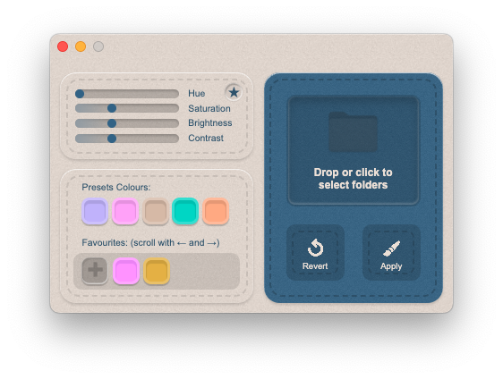

# FolderPaint

   
<b>Icon Converter</b>

 

<a href="https://github.com/MichaelTr7/FolderPaint/releases/download/FolderPaint/FolderPaint.zip>

   
<b>Icon Converter</b>

### Features
- Changes colours of folders on macOS
 

